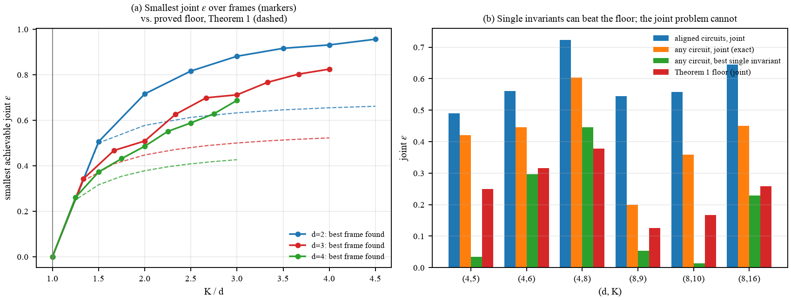
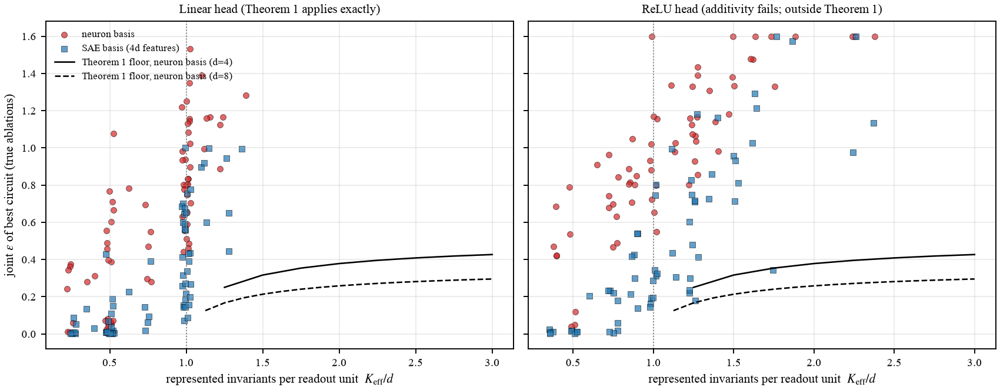
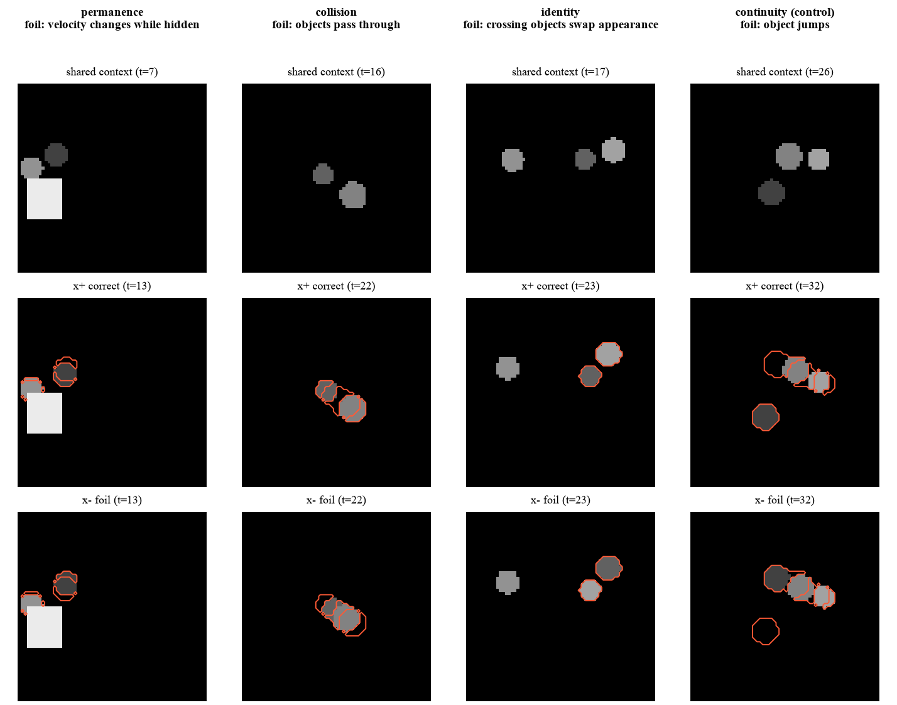
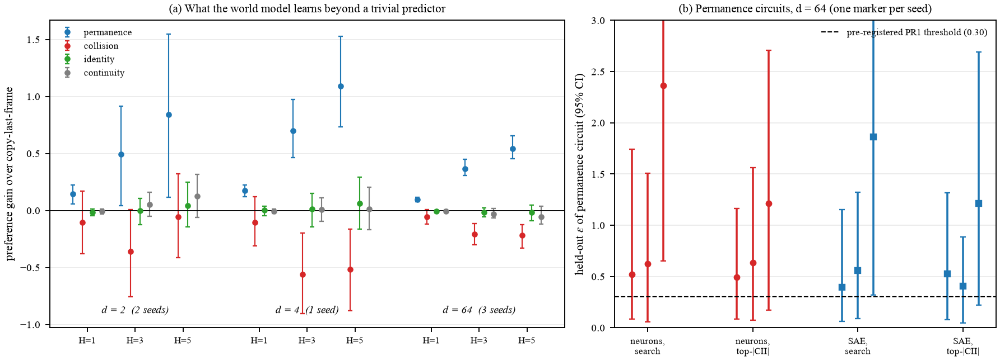

# When Is World-Model Knowledge Localizable?

**Yugandhar Reddy Gogireddy\* · Jithendra Reddy Gogireddy\***
<sub>\*Equal contribution</sub>

This is the code for our paper *When Is World-Model Knowledge Localizable? A
Tight Floor on Circuit Selectivity, and What Trained Predictors Actually Do*.
Everything runs on an ordinary laptop CPU. No GPU is needed.

---

## What this project is about

World models are neural networks that learn how the world behaves by
predicting what happens next in a video. Once one is trained, a natural
question is *where* its knowledge lives. Is there a small part of the network
that knows "a hidden object is still there", and a different part that knows
"objects bounce when they collide"?

Interpretability researchers call such a part a **circuit**. A claim like "this
circuit handles object permanence" is only meaningful if removing the circuit
breaks permanence and leaves everything else alone. We call that property
**selectivity**.

We ask two questions:

1. **When is it even possible** for several pieces of knowledge to each have
   their own selective circuit?
2. **Do trained networks actually build** such circuits?

## What we found

**There is a hard limit, and we can compute it.**
If you want separate circuits for K pieces of knowledge, how selective they can
be depends on one number: the *rank* of a table that records how much each part
of the network matters for each piece of knowledge. When that rank is smaller
than K, perfectly separate circuits are mathematically impossible, and we give
the exact limit. The limit is tight, since some geometries reach it exactly,
and it can be computed for any trained network before searching for circuits.


<sub>Left: the smallest achievable joint selectivity (lower is better) never
drops below the proved limit (dashed). Right: a single piece of knowledge can
look perfectly separable, but the whole set cannot. That is why the limit is
about all pieces at once.</sub>

**Trained networks never beat the limit, but they stay far above it.**
Across 137 trained networks, no circuit went below the limit. Even where the
math allows perfect separation, circuits made of individual neurons were far
from separate. Circuits made of features learned by a sparse autoencoder did
much better: median selectivity 0.14 instead of 0.59, better in 131 of 137
networks. The main obstacle in practice is the choice of building blocks, not
the size of the network.


<sub>Each dot is one trained network. Red: circuits of neurons. Blue: circuits
of sparse-autoencoder features. Black lines: the proved limit.</sub>

**Small physics world models learn one thing well.**
We built a simple 2D physics world with four rules that infants are known to
understand: hidden objects keep existing (*permanence*), objects bounce on
contact (*collision*), objects keep their appearance (*identity*), and objects
move smoothly (*continuity*). For every rule we generate pairs of videos that
are identical until one of them breaks the rule.


<sub>Each column is one rule. Top: the shared start. Middle: what physics says
should happen. Bottom: the rule-breaking version. Red outlines mark where the
two differ.</sub>

We trained small recurrent world models on this world:

- They learned **object permanence**: they predict where a hidden object
  reappears better than simply copying the last frame.
- They did **not** learn **collisions**: they predict objects passing through
  each other, even with four times more training.
- The hidden object's position can be **read off** the network with a simple
  linear probe, yet the units a probe points to matter far less for the
  behaviour than the units that actually drive it (0.34 to 0.64 of the effect).
  Being readable is not the same as being used.
- The best permanence circuits were not as selective as the target we set
  before running the experiments.


<sub>Left: how much better than "copy the last frame" each model predicts each
rule, at 1, 3 and 5 steps ahead. Only permanence (blue) is clearly learned.
Right: selectivity of the best permanence circuits, against the target of 0.30
(dashed).</sub>

Finally, scoring each unit by its effect *at the moment a hidden object
reappears* picks out different units from the usual one-step method, and those
units matter more for permanence in every model we tested.

All numbers are listed in [RESULTS.md](RESULTS.md).

---

## Getting started

You need Python 3.10 or newer.

```bash
pip install -r requirements.txt
bash verify.sh
```

`verify.sh` takes about two minutes. It checks the theory, the physics
environment, the measurement code and a short training run, and ends with
`ALL CHECKS PASSED`.

## Running the experiments

The trained models are included in `checkpoints/`, so you can skip training.

| Step | Command | Time on a laptop |
|---|---|---|
| Check the theory | `python rank_obstruction.py` | about 20 s |
| Trained toy networks | `python trained_toy_phase.py` | about 5 min |
| Look at the physics world | `python environment.py` | about 15 s |
| Measure circuits in the world models | `python jepa_width_sweep.py` | about 10 min |
| Readable vs. used (probes) | `python probe_vs_causal.py` | about 5 min |
| Timing-based patching | `python trp_experiment.py --ckpt checkpoints/hjepa_r64_s0.pt --out results/trp_r64_s0.json` | about 10 min |
| Longer-training control | `python long_run_eval.py` | about 5 min |
| Build the result tables | `python make_tables.py` | a few seconds |

To train a world model yourself (about one hour on three CPU threads):

```bash
python train_hjepa.py --readout 64 --seed 0 --out checkpoints/hjepa_r64_s0.pt
```

`--readout` sets the width of the layer we study. The paper uses widths 2, 4
and 64. The first run of any world-model script builds a cache of training
videos in `data_cache/`, which takes about 20 seconds.

## Project structure

```
.
├── rank_obstruction.py      # the limit: exact computation and numerical checks
├── trained_toy_phase.py     # 156 small trained networks, neurons vs. SAE features
│
├── environment.py           # 2D physics world and the matched video pairs
├── train_hjepa.py           # the recurrent world model and its training loop
├── measure_epsilon.py       # the selectivity measurement and circuit search
├── jepa_width_sweep.py      # runs the measurement on every trained model
├── probe_vs_causal.py       # readable vs. used: probes against causal units
├── trp_experiment.py        # timing-based patching vs. one-step patching
├── long_run_eval.py         # the 4x longer training control
│
├── cii_trp_reference.py     # short, readable description of the method
├── make_tables.py           # turns results/ into the paper's tables
├── figstyle.py              # shared plot style
├── figures/                 # the figures above, and the script for the video pairs
├── results/                 # raw results (JSON) behind every reported number
├── checkpoints/             # the seven trained world models (about 2 MB each)
├── docs/                    # our pre-registered plan and the larger study's protocol
├── RESULTS.md               # every result in plain text
├── CITATION.cff             # powers GitHub's "Cite this repository" button
├── requirements.txt
└── verify.sh                # runs all the checks
```

## Good to know

- **Scale.** The world models are small and were trained on a CPU. The results
  describe this setting and should not be read as claims about large video
  models.
- **What was planned in advance.** Before running the world-model experiments
  we wrote down what would count as success in `docs/preregistration.md`, and
  we report results against those targets, including the ones we missed.

## Citation

If this work is useful to you, please cite it. GitHub's **Cite this repository**
button (right sidebar) gives the citation in APA and BibTeX, from
[`CITATION.cff`](CITATION.cff). Or copy it here:

```bibtex
@misc{gogireddy2026localizable,
  title  = {When Is World-Model Knowledge Localizable? A Tight Floor on Circuit
            Selectivity, and What Trained Predictors Actually Do},
  author = {Gogireddy, Yugandhar Reddy and Gogireddy, Jithendra Reddy},
  year   = {2026}
}
```
